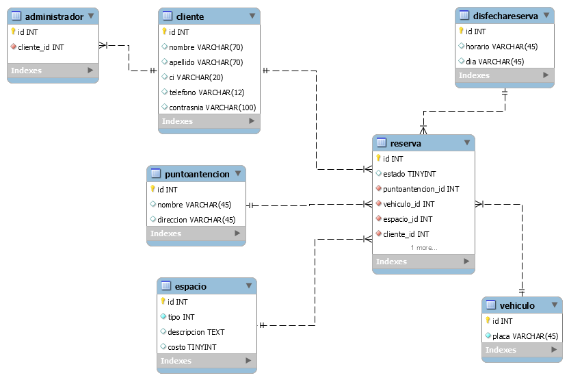

# API Doc v.1 - Parking

## Introducción

Debido al caos vehicular que sufre nuestro país, por el masivo incremento de movilidades y la inseguridad que hay en nuestras calles.
PARKING es un sistema que nos permite hacer reservaciones para nuestros automóviles, el cual cuenta con muchas sucursales en La Paz Bolivia.
Contamos con trabajadores calificados los cuales les brinda un servicio eficiente y eficaz.
Nuestras reservas son digitales, las puede realizar desde cualquier dispositivo
tecnológico.
El sistema Parking nos permite entrar al mercado digital y poder promover nuestro trabajo que esta especialmente diseñado, a la comodidad de los clientes.
Para poder desarrollar el BACK-END se necesito la conexion del servidor de Debian,luego se hizo la elaboracion de las tablas de BBDD,el cual se incorporo al la base de datos de MySQL Workbech , la cual se creo las tablas con sus respectivos atributos.
Tambien utilizamos Visual Studio Code en el cual se hizo la elaboracion de los enponits , y para la visualizacion utilizamos el Postman o el servidor de localhost de Debian. 
## Tecnologías utilizadas

- PHP
- DEBIAN
- VISUAL STUDIO CODE
- MYSQL WORKBENCH
- POSTMAN

## Modelado de la base de datos

El modelado de mi BBDD fue con MYSQL WORKBENCH ,en la cual esta todo lo principal de mis datos de mi Front-End ,los llene con los campos ,atributos ,llaves primarias,llaves foraneas,y la relacion entre ellas. 




**Figura 1** - Modelo relacional base de datos

## API

### Servicios

- ADMINISTRADOR
- CLIENTE
- RESERVA
- PUNTO DE ATENCION
- VEHIULO
- DIAS FECHA RESERVA
- ESPACIO

### CLIENTE

| GET            | [/?endpoint=usuario](https://localhost/api/?endpoint=usuario) |
| -------------- | ------------------------------------------------------------- |
| **Parámetros** | Ninguno                                                       |

##### Cuerpo

Ninguno

##### Respuestas

```json
status: 200
[
    {
        id:1,
        nombre: "Pepito",
        ...
    }, ...
]
```

```json
status: 400
{
    mensaje: "No se pudo obtener los datos"
}
```

| GET            | [/?endpoint=usuario&id=:id](https://localhost/api/?endpoint=usuario&id=:id) |
| -------------- | --------------------------------------------------------------------------- |
| **Parámetros** | **:id** Identificador del usuario.                                          |

##### Cuerpo

Ninguno

##### Respuestas

```json
status: 200
    {
        id:1,
        nombre: "Pepito",
        ...
    }
```

```json
status: 400
{
    mensaje: "No se pudo obtener al usuario"
}
```

| POST           | [/?endpoint=usuario](https://localhost/api/?endpoint=usuario) |
| -------------- | ------------------------------------------------------------- |
| **Parámetros** | Ninguno                                                       |

##### Cuerpo

```json
{
  "nombre": "Pepito", //Requerido
  "apellido": "Perez", //Opcional
  "usuario": "usuario", //Requerido
  "contraseña": "123321" //Requerido
}
```

##### Respuestas

```json
status: 200
    {
        id:1
    }
```

```json
status: 400
{
    mensaje: "No se pudo registrar al usuario"
}
```

```json
status: 401
{
    mensaje: "Faltan datos requeridos"
}
```

| PUT            | [/?endpoint=usuario&id=:id](https://localhost/api/?endpoint=usuario&id=:id) |
| -------------- | --------------------------------------------------------------------------- |
| **Parámetros** | **:id** Identificador del usuario                                           |

##### Cuerpo

```json
{
  "nombre": "Pepito", //Requerido
  "apellido": "Perez", //Opcional
  "usuario": "usuario", //Requerido
  "contraseña": "123321" //Requerido
}
```

##### Respuestas

```json
status: 200
{
    mensaje:"Usuario actualizado"
}
```

```json
status: 400
{
    mensaje: "No se pudo actualizar al usuario"
}
```

| DELETE         | (http://localhost/lesly/controllers/ClienteControllers.php)
| -------------- | --------------------------------------------------------------------------- |
| **Parámetros** | **:id**datos del cliente en reserva                                            |

##### Cuerpo

Ninguno

##### Respuestas

```json
status: 200
{
    mensaje:"Usuario eliminado"
}
```

```json
status: 400
{
    mensaje: "No se pudo eliminar al usuario"
}
```

| POST           | ) |(http://localhost/lesly/controllers/ClienteControllers.php)
| -------------- | --------------------------------------------------------- |
| **Parámetros** | Ninguno                                                   |

##### Cuerpo

```json
{

    "nombre":"paty",
    "apellido":"lendjfj",
    "ci":"83847837",
    "telefono":"7474748",
    "contrasnia":"74yrfhbf",

}
```

##### Respuestas

```json
status: 200
{
    token:"4asd2asd42sad8geguyi8SADsaoiupdklksad95sad"
}
```

```json
status: 400
{
    mensaje: "Usuario y/o contraseña incorrectas"
}
```

```json
status: 401
{
    mensaje: "Faltan datos requeridos"
}
```

### Repositorio

///<https://github.com/leslycarrillo/Parking/tree/backend>, así mismo, el proyecto se trabajo bajo la
rama Master.
